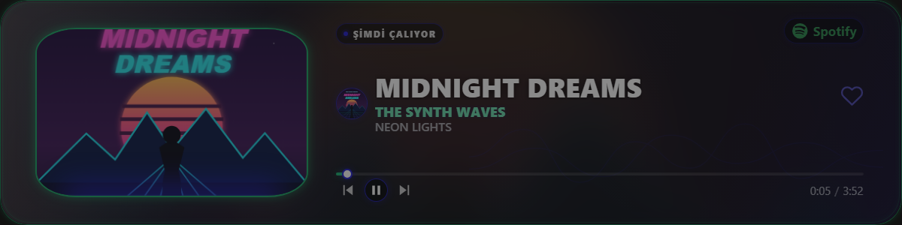
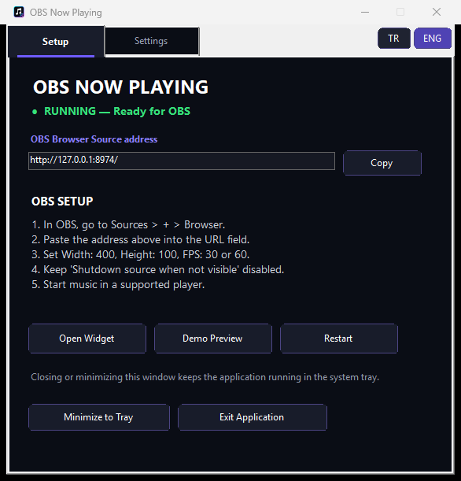
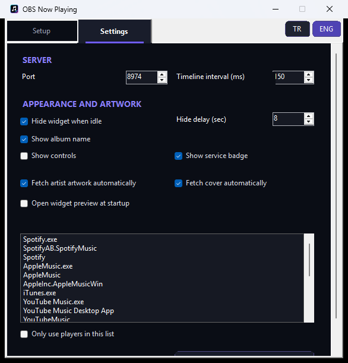

# OBS Now Playing

[Türkçe dokümantasyon](README_TR.md)

A portable, installer-free Windows now-playing widget for OBS Studio. It reads Windows media sessions and displays the active track in a compact 400×100 Dynamic Neon browser source.

## Screenshots

### Dynamic Neon widget

### Control panel

### Settings

## Features

- Spotify, Apple Music, YouTube Music, Deezer, and browser-media support
- Prioritized Windows media-session selection
- Deezer artwork lookup with iTunes Search API fallback
- Dynamic neon accent colors derived from album artwork
- Readable artist and track names with marquee animation for long titles
- Live progress, service badge, and optional playback controls
- Turkish and English control panel and widget UI
- Copyable OBS Browser Source URL
- Idle hiding, player priority, artwork, and appearance settings
- Portable Windows application with system-tray support

## Download

Download the latest ready-to-run Windows ZIP from the repository's **Releases** page. Extract the archive and run `OBSNowPlaying.exe`; no installer or account is required.

## OBS setup

1. Start `OBSNowPlaying.exe`.
2. In OBS Studio, add a **Browser** source.
3. Use `http://127.0.0.1:8974/` as its URL.
4. Set width to `400`, height to `100`, and FPS to `30` or `60`.
5. Keep **Shutdown source when not visible** disabled.

The control panel displays the current URL and lets you copy it. If you change the port, update the Browser Source URL in OBS.

## Supported sources

The application prioritizes Spotify, Apple Music, YouTube Music desktop clients, and Deezer. If none is active, compatible browser media sessions from Edge, Chrome, or Firefox can be displayed.

## Privacy and security

- The HTTP server listens only on `127.0.0.1`.
- Track metadata stays on the local machine.
- Public Deezer and iTunes endpoints are used only to find missing artwork.
- No API key, analytics service, account, or telemetry is used.

The executable is currently unsigned. Windows SmartScreen or antivirus software may therefore show a warning. Review the source and build it locally if preferred.

## AI-assisted development

This project was developed with assistance from OpenAI ChatGPT and Codex. AI tools were used for code generation, debugging, UI development, documentation, testing, and architectural improvements. The repository owner reviewed, tested, packaged, and published the project.

This project is not affiliated with or endorsed by OpenAI, Spotify, Apple, YouTube, Deezer, Microsoft, or OBS Studio.

## Contributing

Bug reports and pull requests are welcome. See [CONTRIBUTING.md](CONTRIBUTING.md) before contributing. For security concerns, see [SECURITY.md](SECURITY.md).

## License

Released under the [MIT License](LICENSE).
