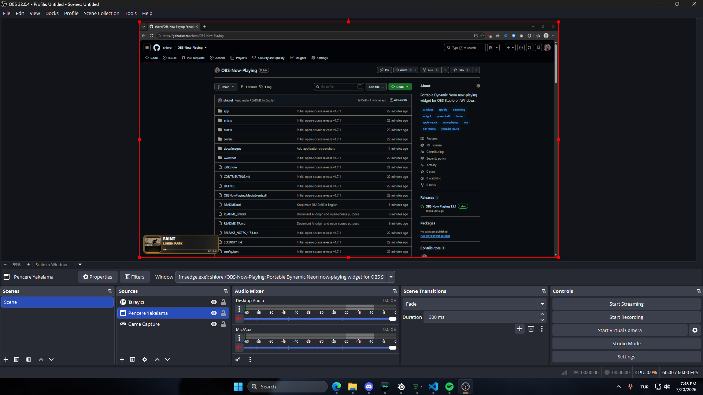

# OBS Now Playing Widget

Windows'ta çalan şarkıyı OBS üzerinde gösteren, kurulum gerektirmeyen taşınabilir uygulamadır. Dinamik Neon tema albüm kapağından uygun vurgu rengini yerel olarak çıkarır.

## Projenin hikâyesi ve açık kaynak kullanımı

Bu proje, [shiorel](https://github.com/shiorel) yönlendirmesiyle başta OpenAI ChatGPT ve Codex olmak üzere tamamen yapay zekâ araçları kullanılarak oluşturulmuştur. Proje; sahibinin OBS Studio için pratik, okunabilir ve taşınabilir bir şimdi çalıyor widget'ına duyduğu kişisel ihtiyacı karşılamak amacıyla yapılmıştır. Gereksinimler proje sahibi tarafından belirlenmiş, geliştirme yönlendirilmiş, uygulama test edilmiş ve son ürün yayımlanmıştır.

OBS Now Playing, MIT Lisansı altında açık kaynaklıdır. Projeyi kişisel veya ticari amaçlarla kullanabilir, kopyalayabilir, değiştirebilir, geliştirebilir ve yeniden dağıtabilirsiniz. Repository'yi fork ederek istediğiniz yönde geliştirebilirsiniz. Projeyi kullanırken veya yeniden dağıtırken lisans ve telif bildirimini korumanız ve özgün proje sahibi olarak **shiorel** kullanıcı adını belirtmeniz rica edilir.

## Diğer şimdi çalıyor widget'larından farkı nedir?

Birçok şimdi çalıyor widget'ı yalnızca tek bir müzik servisine bağlıdır veya OAuth kurulumu, API anahtarı, kullanıcı hesabı ya da internette barındırılan ek bir servis gerektirir. OBS Now Playing ise Windows medya oturumlarını yerel olarak okuyarak Spotify, Apple Music, YouTube Music, Deezer ve uyumlu tarayıcı oynatıcılarını tek bir widget ile, müzik servisi hesabı veya API anahtarı istemeden destekler.

- **Birden fazla oynatıcı için tek widget:** Önce özel müzik uygulamalarına öncelik verir, gerektiğinde uyumlu tarayıcı medyasına geçer.
- **Taşınabilir ve kurulum gerektirmez:** ZIP'i çıkartıp uygulamayı çalıştırmak yeterlidir; CMD, web hosting veya installer gerekmez.
- **Yerel ve gizlilik odaklıdır:** Widget sunucusu yalnızca `127.0.0.1` üzerinde çalışır; şarkı bilgileri analiz veya hesap servislerine gönderilmez.
- **OBS okunabilirliği için özel tasarlanmıştır:** 400×100 düzen şarkı ve sanatçı adlarını öne çıkarır; uzun şarkı adları üç noktayla kesilmek yerine kaydırılarak gösterilir.
- **Eksik görselleri tamamlar:** Bulunamayan kapaklar önce Deezer, ardından iTunes Search API üzerinden aranabilir ve indirilen görseller yerel cache içinde saklanır.
- **Uyarlanabilir Dinamik Neon görünüm:** Neon outline ve vurgu renkleri okunabilirlik korunarak mevcut albüm kapağından otomatik türetilir.
- **Dahili masaüstü kontrol paneli:** OBS kurulum anlatımı, kopyalanabilir Browser Source adresi, oynatıcı önceliği, boşta gizleme, görsel seçenekleri ve TR/ENG dil kontrolleri tek UX içinde bulunur.
- **Canlı davranış:** Ayar ve dil değişiklikleri uygulamanın tamamen yeniden başlatılmasına gerek kalmadan açık OBS Browser Source'a ulaşır.

## Ekran görüntüleri

### Dinamik Neon widget

### OBS Studio içinde

Widget, şeffaf bir Tarayıcı Kaynağı olarak herhangi bir OBS sahnesinin üzerine konumlandırılıp ölçeklendirilebilir.

### Kontrol paneli

### Ayarlar

## Başlatma

Uygulama Windows dili Türkçeyse Türkçe, diğer tüm sistem dillerinde İngilizce açılır. Kontrol panelinin sağ üstündeki `TR` ve `ENG` düğmeleriyle dili uygulamayı yeniden başlatmadan değiştirebilirsin.

Kontrol panelinde seçilen dil widget'a da canlı uygulanır. `ŞİMDİ ÇALIYOR / NOW PLAYING`, bekleme ve bilinmeyen parça metinleri UX diliyle birlikte değişir.

Modern kontrol panelinden görünüm ve oynatıcı ayarları değiştirilebilir. `Müzik yokken widget'i gizle` ayarı açık olduğunda widget, belirlenen gecikmenin ardından tamamen gizlenir. OBS Browser Source açık kalsa bile ayar değişiklikleri canlı olarak alınır.

1. ZIP paketini bir klasöre çıkart.
2. `OBSNowPlaying.exe` dosyasına çift tıkla.
3. Uygulama Windows sistem tepsisinde çalışmaya başlar.
4. Spotify veya Windows medya denetimlerini destekleyen başka bir oynatıcıdan müzik başlat.

CMD, BAT dosyası, kurulum veya kullanıcı hesabı gerekmez.

## OBS kurulumu

OBS Studio içinde:

1. Kaynaklar bölümünden `+` düğmesine bas.
2. `Tarayıcı` kaynağını seç.
3. URL alanına `http://127.0.0.1:8974/` yaz.
4. Genişliği `400`, yüksekliği `100` yap.
5. FPS değerini `30` veya `60` seç.
6. `Kaynak görünür olmadığında kapat` seçeneğini kapalı bırak.
7. `Sahne aktif olduğunda tarayıcıyı yenile` seçeneğini kapalı bırak.

Widget doğrudan Neon temayla açılır. Tema parametresi eklemek gerekmez.

## Sistem tepsisi

Uygulama ikonuna çift tıklamak normal widget görünümünü tarayıcıda açar. Sağ tık menüsünde:

- `Widget'i Ac`
- `Demo Onizleme`
- `OBS Adresini Kopyala`
- `Yeniden Baslat`
- `Kapat`

seçenekleri bulunur.

## Özellikler

- Dinamik Neon görünüm
- Olay tabanlı medya güncellemeleriyle düşük CPU kullanımı
- Albüm kapağına göre otomatik vurgu rengi
- Okunabilir şarkı ve sanatçı isimleri
- Uzun şarkı adlarında otomatik kaydırma
- Canlı ilerleme çubuğu ve süre bilgisi
- Önceki, oynat/duraklat ve sonraki parça kontrolleri
- Albüm kapağı ve sanatçı görseli önbelleği
- Spotify ve genel Windows medya kaynakları desteği
- Oynatıcı önceliği: Spotify → Apple Music → YouTube Music/Desktop App → Deezer → tarayıcılar
- Şeffaf OBS arka planı
- `400 × 100` kompakt yayın düzeni

## Önizleme

Demo görünümü sistem tepsisi menüsünden açılabilir veya şu adres kullanılabilir:

`http://127.0.0.1:8974/?demo=1`

## Ayarlar

`config.json` dosyasındaki temel seçenekler:

- `port`: Yerel sunucu portu. Varsayılan `8974`.
- `pollIntervalMs`: Hafif timeline güncellemesinin temel aralığıdır; parça ve oynatma değişiklikleri Windows olaylarıyla anında alınır. Etkin değer performans için `500–1000 ms` aralığına sınırlandırılır.
- `preferredPlayers`: Birden fazla oynatıcı açıkken öncelik sırası.
- `onlyPreferredPlayers`: Yalnızca listedeki oynatıcıları kullanır.
- `openPreviewOnStart`: Uygulama açılırken tarayıcı önizlemesini açar.
- `autoFetchArtistImages`: Sanatçı görsellerini otomatik tamamlar.
- `autoFetchCoverImages`: Eksik kapakları otomatik tamamlar.

## Sorun giderme

- Widget açılmıyorsa `log.txt` dosyasını kontrol et.
- Port kullanımdaysa `config.json` içindeki portu ve OBS URL'sini birlikte değiştir.
- Şarkı bilgisi gelmiyorsa oynatıcıyı yeniden başlat ve Windows medya panelinde şarkının göründüğünü kontrol et.
- OBS eski görünümü gösteriyorsa Tarayıcı kaynağında `Geçerli sayfanın önbelleğini yenile` seçeneğini kullan.
- Uygulamayı kapatmak için sistem tepsisi menüsündeki `Kapat` seçeneğini kullan.

## Gereksinimler

- Windows 10 sürüm 1809 veya üzeri ya da Windows 11
- OBS Studio
- Windows medya oturumlarını destekleyen bir müzik oynatıcı
- Otomatik görsel tamamlama için internet bağlantısı

## Lisans

MIT License.

## Yapay zekâ destekli geliştirme

Bu proje OpenAI ChatGPT ve Codex desteğiyle geliştirilmiştir. Yapay zekâ araçları kod üretimi, hata ayıklama, UX geliştirme, dokümantasyon, test ve mimari iyileştirmelerde kullanılmıştır. Projenin kontrolü, testleri, paketlenmesi ve yayımlanması repository sahibi tarafından yapılmıştır.

Bu proje OpenAI, Spotify, Apple, YouTube, Deezer, Microsoft veya OBS Studio tarafından desteklenen ya da bu kuruluşlarla bağlantılı resmî bir uygulama değildir.
